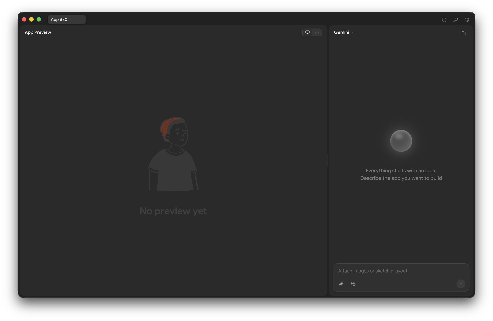
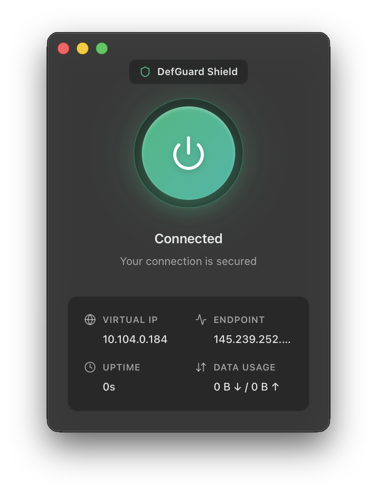
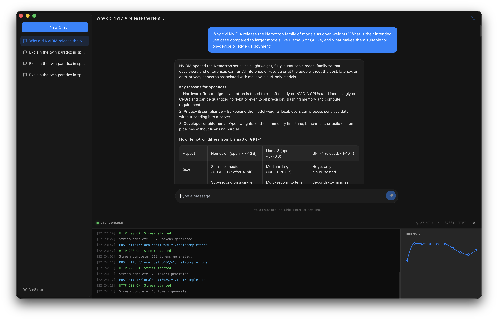
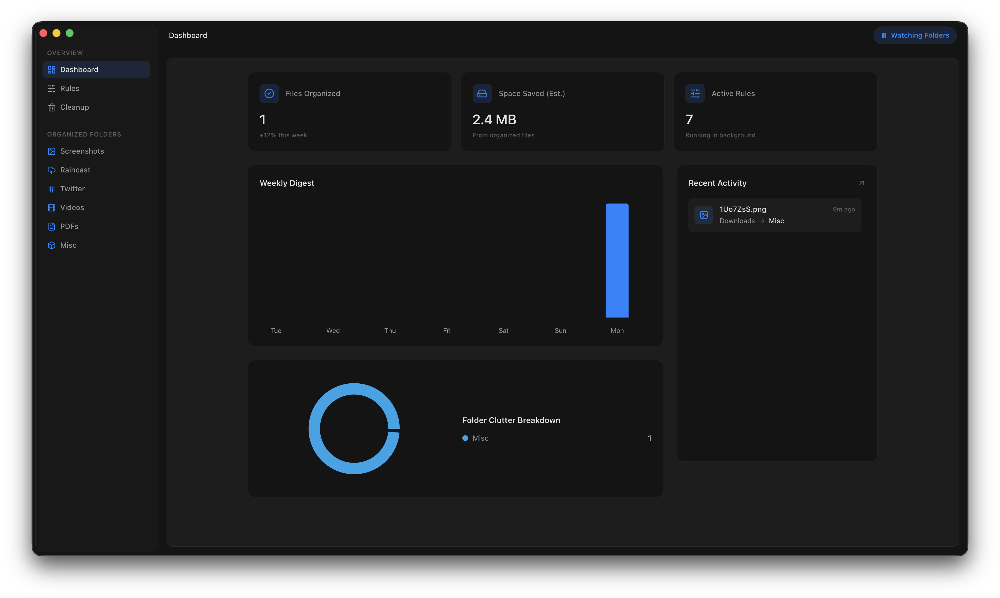

<p align="center">
  
</p>

<h1 align="center">Raincast</h1>

<p align="center">
  Describe an app. Get a native desktop app.<br/>
  AI-powered app generator that builds real, shippable Tauri applications from natural language.
</p>

<p align="center">
  
  
  
  
</p>

<p align="center">
  <a href="#installation">Install</a> &middot;
  <a href="#how-it-works">How It Works</a> &middot;
  <a href="#examples">Examples</a>
</p>

<p align="center">
  
</p>

---

## What is Raincast?

Raincast is a desktop application that generates other desktop applications. You describe what you want in plain English, and Raincast builds a fully functional native app:with a real UI, backend commands, file system access, and system integration. Not a mockup. Not a prototype. A compiled, shippable application.

It generates React + Tauri apps with:
- **9 layout templates**:dashboard, editor, chat, file manager, media player, data table, playground, utility, and generic
- **Rust backend**:AI writes Tauri commands for file I/O, shell execution, system monitoring, network calls
- **Native window chrome**:transparent backgrounds, macOS vibrancy, overlay title bars, custom window sizes
- **Live preview**:see your app running as it's being built, with hot reload
- **One-click ship**:compile to a standalone binary you can distribute

## How It Works

You describe what you want, and Raincast generates the full app: React frontend, Rust backend commands, and Tauri config.

The interesting part is how the **live preview** works. Generated apps call Rust backend commands via Tauri's `invoke()` bridge, but in dev mode the full Tauri binary isn't compiled yet. So Raincast builds a **proxy binary**: it parses the generated Rust source using AST extraction to find every `#[tauri::command]` function, then generates a standalone CLI binary that reads JSON from stdin, dispatches to the same functions, and writes JSON to stdout. The frontend's `invoke()` calls get routed through this proxy instead of the real Tauri runtime. This means the preview behaves like the real app: file system access, shell commands, system info all work during development, not just after shipping.

When you hit **Ship**, Raincast compiles the actual Tauri binary with all the real commands baked in. The proxy is only for dev.

### AI Providers

Raincast supports multiple AI backends:

| Provider | Models | Best For |
|----------|--------|----------|
| **Anthropic Claude** | Sonnet 4.6 (pro), Haiku 4.5 (fast) | Complex apps, accurate code |
| **Google Gemini** | 3.1 Pro, 3 Flash | Fast iteration, multimodal |

Bring your own API key. Set it in the app settings.

Want to add **OpenAI Codex**, **xAI Grok**, **DeepSeek**, **Mistral**, or another provider? PRs are welcome:or [open an issue](https://github.com/tihiera/raincast/issues) and we'll prioritize it.

## Installation

### macOS

```bash
curl -fsSL https://raw.githubusercontent.com/tihiera/raincast/main/scripts/install-macos.sh | bash
```

This checks for Rust and Node.js, installs them if missing, builds from source, and places the app in `/Applications`.

**Or build manually:**

```bash
git clone https://github.com/tihiera/raincast.git
cd raincast
npm install
npm run tauri dev     # development
npm run tauri build   # production binary
```

### Windows

Download `Raincast_x.x.x_x64-setup.exe` from [Releases](https://github.com/tihiera/raincast/releases) and run it.

### Linux (Debian/Ubuntu)

```bash
# Download the .deb from Releases, then:
sudo dpkg -i raincast_x.x.x_amd64.deb
sudo apt-get install -f
```

Or download the `.AppImage` from [Releases](https://github.com/tihiera/raincast/releases), make it executable, and run.

### Prerequisites (manual build only)

- [Node.js](https://nodejs.org) 18+
- [Rust](https://rustup.rs)
- Xcode Command Line Tools (macOS): `xcode-select --install`
- Linux: `sudo apt install libwebkit2gtk-4.1-dev libappindicator3-dev librsvg2-dev patchelf libgtk-3-dev libsoup-3.0-dev`

## Examples

<details>
<summary><strong>Utility Apps</strong></summary>

Compact, single-purpose tools with frosted glass windows.

**"Build a VPN status utility that shows my current public IP, connection location on a minimal world map, and a one-click toggle to connect/disconnect. Show latency, upload/download speed, and connection uptime."**



</details>

<details>
<summary><strong>Full Applications</strong></summary>

**"Build a local AI chat app that connects to a [llama.cpp](https://github.com/ggml-org/llama.cpp) server running on my machine. Chat interface with streamed responses, a model picker, and a collapsible dev console showing connection status and server logs."**



</details>

<details>
<summary><strong>Games</strong></summary>

**"Build a side-scrolling platformer inspired by Super Mario. Pixel-art style sprites with vibrant colors, parallax scrolling backgrounds with gradient skies, a HUD with score, coins, and lives, particle effects on coin collection, and screen shake on damage."**


</details>

<details>
<summary><strong>Automation</strong></summary>

**"Build a compact file organizer that watches Desktop and Downloads, auto-sorts files by filename patterns into categorized folders, shows macOS-style toast notifications, and has a live feed of recently sorted files."**



</details>

## Development

```bash
# Start dev mode (frontend + Tauri backend)
npm run tauri dev

# Frontend only (port 1420)
npm run dev

# Build production binary
npm run tauri build

# Run editkit tests
cd packages/editkit && npm test
```

## Contributing

If you want to contribute:

1. Fork the repo
2. Create a feature branch
3. Make your changes
4. Run `npm run tauri dev` to verify
5. Open a PR

## License

MIT
